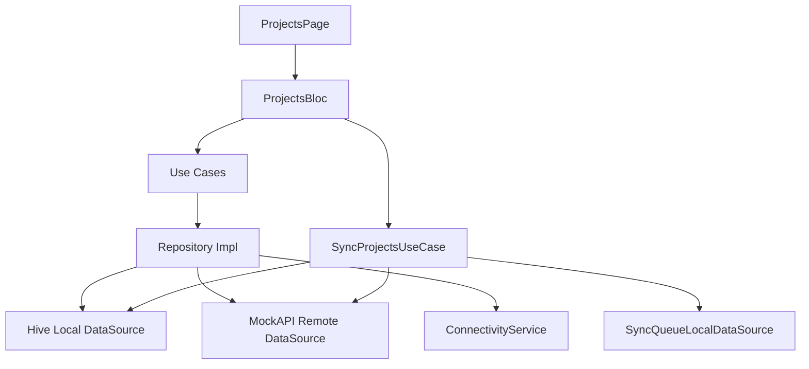
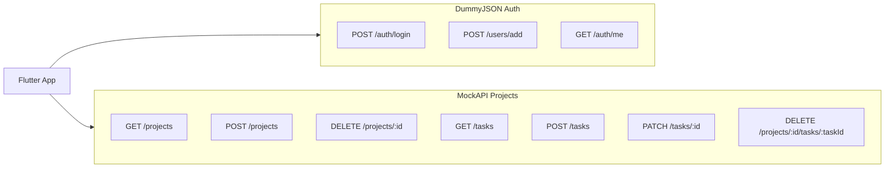

# Task Manager

A Flutter task management app built with **Clean Architecture**, **BLoC** state management, and modern Flutter practices. It authenticates users via [DummyJSON](https://dummyjson.com), manages projects and tasks via [MockAPI](https://mockapi.io) with **offline-first hybrid sync**, persists auth sessions via SharedPreferences, and caches projects/tasks locally with Hive.

**Tech stack:** Flutter · Dio · GetIt · GoRouter · flutter_bloc · SharedPreferences · Hive · ScreenUtil

---

## Features

### Authentication
- Login and registration
- Session persistence (access + refresh tokens)
- Route guards — unauthenticated users are redirected to login

### Projects
- List projects filtered by logged-in user
- Create and delete projects
- Project status enrichment from task completion

### Tasks
- List tasks per project
- Add tasks with priority
- Mark tasks as done
- Delete tasks via swipe actions (`flutter_slidable`)

### Offline and Sync
- **Offline read** — projects and tasks load from Hive cache when the network is unavailable
- **Offline write** — changes are saved locally and queued in a sync outbox
- **Online write** — MockAPI is called immediately and the local cache is updated (hybrid model)
- **Sync projects** — AppBar sync button on the projects screen pushes queued offline changes, remaps negative local IDs to server IDs, and pulls the latest remote data
- **Local IDs** — offline-created projects/tasks use negative IDs until sync; after sync, IDs are remapped and project ID mappings are stored in Hive `meta_box`
- **Task cache merge** — online refresh **merges** remote tasks into Hive without deleting pending or recently synced local tasks; sync pull **reconciles** deletions and preserves just-pushed task IDs when MockAPI GET lags behind POST
- **Session-scoped tasks** — MockAPI task responses often omit `userId`; the app always stores tasks under the logged-in user's ID (and migrates legacy `userId: 0` entries on read)
- **UX indicators** — offline banner, pending-change badge on the sync icon, sync disabled while offline

Key implementation files:
- [lib/core/network/connectivity_service.dart](lib/core/network/connectivity_service.dart)
- [lib/features/projects/data/datasources/tasks_local_datasource.dart](lib/features/projects/data/datasources/tasks_local_datasource.dart)
- [lib/features/projects/data/repositories/sync_repository_impl.dart](lib/features/projects/data/repositories/sync_repository_impl.dart)
- [lib/features/projects/data/repositories/tasks_repository_impl.dart](lib/features/projects/data/repositories/tasks_repository_impl.dart)
- [lib/features/projects/domain/usecases/sync_projects_usecase.dart](lib/features/projects/domain/usecases/sync_projects_usecase.dart)
- [lib/features/projects/presentation/pages/projects_page.dart](lib/features/projects/presentation/pages/projects_page.dart)

### Profile
- Display user information
- Local profile cache with remote refresh via `GET /auth/me`

### Theme
- Light, dark, and system theme modes via `ThemeCubit`

### UX
- Responsive layout (`flutter_screenutil`)
- Loading skeletons (`skeletonizer`)
- Network image caching (`cached_network_image`)
- Connectivity-aware repositories and sync via `ConnectivityService` (`internet_connection_checker_plus`)

---

## Architecture

The app follows **Clean Architecture** with three layers per feature. Auth, profile, and theme use SharedPreferences for local persistence; projects and tasks use Hive with a hybrid online/offline repository pattern.

| Layer | Responsibility |
|-------|----------------|
| **Presentation** | Pages, widgets, BLoC/Cubit (events & states) |
| **Domain** | Entities, repository contracts, use cases |
| **Data** | Models, data sources (local & remote), repository implementations |



**Key files:**
- [lib/core/di/dependency_injection.dart](lib/core/di/dependency_injection.dart) — GetIt service registration
- [lib/core/routes/app_router.dart](lib/core/routes/app_router.dart) — GoRouter routes and auth redirects
- [lib/core/network/dio_factory.dart](lib/core/network/dio_factory.dart) — Dio clients and Bearer token interceptor
- [lib/core/network/api_constants.dart](lib/core/network/api_constants.dart) — Base URLs and endpoint paths
- [lib/core/network/connectivity_service.dart](lib/core/network/connectivity_service.dart) — Online/offline detection
- [lib/core/storage/hive_storage.dart](lib/core/storage/hive_storage.dart) — Hive box initialization

---

## Project Structure

```text
lib/
├── core/
│   ├── constants/       # App-wide configuration
│   ├── di/              # Dependency injection (GetIt)
│   ├── errors/          # Exceptions and failures
│   ├── network/         # Dio factory, API constants, connectivity service
│   ├── routes/          # GoRouter configuration
│   ├── storage/         # SharedPreferences wrappers, Hive storage
│   ├── theme/           # Light/dark themes and extensions
│   ├── utils/           # Validators, safe_call, snackbar helpers
│   └── widgets/         # Reusable UI components
│
├── features/
│   ├── auth/            # Login, register, session management
│   ├── profile/         # User profile display
│   ├── projects/        # Projects + tasks, offline cache, sync
│   │   ├── data/
│   │   │   ├── datasources/   # Remote, local (Hive), sync queue
│   │   │   ├── models/        # API models, local records, sync entries
│   │   │   ├── repositories/  # Hybrid repos + sync_repository_impl
│   │   │   └── services/      # user_projects_storage_cleaner
│   │   ├── domain/            # Entities, use cases (incl. sync)
│   │   └── presentation/      # projects_bloc, tasks_bloc, pages
│   └── theme/           # Theme mode persistence
│
└── main.dart
```

Each feature module contains `data/`, `domain/`, and `presentation/` subfolders following the repository and use-case pattern.

---

## App Routes

Defined in [lib/core/routes/app_router.dart](lib/core/routes/app_router.dart):

| Route | Screen | Notes |
|-------|--------|-------|
| `/login` | Login | Initial route for unauthenticated users |
| `/register` | Register | |
| `/projects` | Projects list | Default route after login |
| `/profile` | Profile | |
| `/projects/:id` | Project details | Requires `ProjectEntity` passed as `extra` |

Authenticated users visiting `/login` or `/register` are redirected to `/projects`.

---

## API Reference

The app talks to **two separate backends**. Both Dio clients attach a `Bearer` token from local storage when available (see [dio_factory.dart](lib/core/network/dio_factory.dart)).

- **Connect timeout:** 30 seconds
- **Receive timeout:** 30 seconds
- **Content-Type:** `application/json`



---

### Backend 1: DummyJSON (Authentication)

**Base URL:** `https://dummyjson.com`

**Source:** [lib/features/auth/data/datasources/auth_remote_datasource.dart](lib/features/auth/data/datasources/auth_remote_datasource.dart)

#### Demo Credentials

Use any user from [dummyjson.com/users](https://dummyjson.com/users). The login screen shows:

| Username | Password |
|----------|----------|
| `emilys` | `emilyspass` |
| `emmaj` | `emmajpass` |

---

#### POST `/auth/login`

Authenticate an existing user and receive JWT tokens.

| | |
|---|---|
| **Auth required** | No |
| **Used by** | Login feature |
| **Source** | `AuthRemoteDataSource.login()` |

**Request body:**

```json
{
  "username": "emilys",
  "password": "emilyspass",
  "expiresInMins": 60
}
```

| Field | Type | Required | Default | Description |
|-------|------|----------|---------|-------------|
| `username` | string | Yes | — | DummyJSON username |
| `password` | string | Yes | — | DummyJSON password |
| `expiresInMins` | int | No | `60` | Access token lifetime in minutes |

**Success response (200):**

```json
{
  "id": 1,
  "username": "emilys",
  "email": "emily.johnson@x.dummyjson.com",
  "firstName": "Emily",
  "lastName": "Johnson",
  "image": "https://dummyjson.com/icon/emilys/128",
  "accessToken": "eyJhbGciOiJIUzI1NiIsInR5cCI6IkpXVCJ9...",
  "refreshToken": "eyJhbGciOiJIUzI1NiIsInR5cCI6IkpXVCJ9..."
}
```

**Error responses:** `400` / `401` are mapped to `UnauthorizedException` with the server message.

**curl example:**

```bash
curl -X POST https://dummyjson.com/auth/login \
  -H "Content-Type: application/json" \
  -d '{"username":"emilys","password":"emilyspass","expiresInMins":60}'
```

---

#### POST `/users/add`

Register a new user. The app sends the same token-related fields as login and expects a user object with tokens in the response.

| | |
|---|---|
| **Auth required** | No |
| **Used by** | Register feature |
| **Source** | `AuthRemoteDataSource.register()` |

**Request body:**

```json
{
  "username": "newuser",
  "email": "newuser@example.com",
  "password": "securepass123",
  "expiresInMins": 60
}
```

| Field | Type | Required | Default | Description |
|-------|------|----------|---------|-------------|
| `username` | string | Yes | — | Desired username |
| `email` | string | Yes | — | User email |
| `password` | string | Yes | — | User password |
| `expiresInMins` | int | No | `60` | Access token lifetime in minutes |

**Success response:** Same shape as login — parsed fields: `id`, `username`, `email`, `firstName`, `lastName`, `image`, `accessToken`, `refreshToken`.

**curl example:**

```bash
curl -X POST https://dummyjson.com/users/add \
  -H "Content-Type: application/json" \
  -d '{"username":"newuser","email":"newuser@example.com","password":"securepass123","expiresInMins":60}'
```

---

#### GET `/auth/me`

Return the currently authenticated user's profile.

| | |
|---|---|
| **Auth required** | Yes — `Authorization: Bearer {accessToken}` |
| **Used by** | Profile feature (via `AuthUserReader`) |
| **Source** | `AuthRemoteDataSource.getMe()` |

**Request:** No body. Bearer token is attached automatically by the Dio interceptor.

**Success response (200):**

```json
{
  "id": 1,
  "username": "emilys",
  "email": "emily.johnson@x.dummyjson.com",
  "firstName": "Emily",
  "lastName": "Johnson",
  "image": "https://dummyjson.com/icon/emilys/128"
}
```

**Error responses:** `401` throws `UnauthorizedException`.

**curl example:**

```bash
curl https://dummyjson.com/auth/me \
  -H "Authorization: Bearer YOUR_ACCESS_TOKEN"
```

---

#### POST `/auth/refresh` *(not implemented)*

Defined as a constant in [api_constants.dart](lib/core/network/api_constants.dart) but **not wired** in the app. Available on DummyJSON for future token refresh:

```json
{
  "refreshToken": "YOUR_REFRESH_TOKEN",
  "expiresInMins": 60
}
```

---

### Backend 2: MockAPI (Projects & Tasks)

**Base URL:** `https://6a3e00650443193a1a0b4a35.mockapi.io/`

**Sources:**
- [lib/features/projects/data/datasources/projects_remote_datasource.dart](lib/features/projects/data/datasources/projects_remote_datasource.dart)
- [lib/features/projects/data/datasources/tasks_remote_datasource.dart](lib/features/projects/data/datasources/tasks_remote_datasource.dart)
- [lib/features/projects/data/datasources/dio_projects_client.dart](lib/features/projects/data/datasources/dio_projects_client.dart)

The projects Dio client treats HTTP status codes `< 500` as non-throwing responses.

> **Offline note:** When the device is offline, create/update/delete operations are stored in Hive and queued for sync. After reconnecting, tap **Sync** in the projects AppBar to push pending changes to MockAPI, then reopen the project or pull-to-refresh the task list.

> **MockAPI quirk:** Task `POST`/`GET` responses may omit `userId` (and may return numeric IDs as strings). The app normalizes these fields locally and does not rely on the API for ownership.

---

#### GET `/projects?userId={userId}`

List all projects belonging to a user.

| | |
|---|---|
| **Auth required** | Bearer token attached (if logged in) |
| **Used by** | Projects list |
| **Source** | `ProjectsRemoteDataSource.getProjects()` |

**Query parameters:**

| Param | Type | Required | Description |
|-------|------|----------|-------------|
| `userId` | int | Yes | Logged-in user's ID |

**Success response (200):** JSON array of project objects.

```json
[
  {
    "id": 1,
    "name": "Mobile App",
    "userId": 1,
    "createdAt": 1719494400,
    "description": "Flutter task manager",
    "status": "active"
  }
]
```

**Edge cases:** `404` or a non-array response returns an empty list in the app.

**curl example:**

```bash
curl "https://6a3e00650443193a1a0b4a35.mockapi.io/projects?userId=1"
```

---

#### POST `/projects`

Create a new project.

| | |
|---|---|
| **Auth required** | Bearer token attached (if logged in) |
| **Used by** | Create project |
| **Source** | `ProjectsRemoteDataSource.createProject()` |

**Request body:**

```json
{
  "name": "My Project",
  "description": "Project description",
  "status": "active",
  "userId": 1,
  "createdAt": 1719494400
}
```

| Field | Type | Required | Default | Description |
|-------|------|----------|---------|-------------|
| `name` | string | Yes | — | Project name |
| `description` | string | Yes | — | Project description |
| `status` | string | Yes | `"active"` | Project status |
| `userId` | int | Yes | — | Owner user ID |
| `createdAt` | int | Yes | current Unix timestamp | Creation time (seconds) |

**Success response (201):** Single project object (same shape as list item).

**curl example:**

```bash
curl -X POST https://6a3e00650443193a1a0b4a35.mockapi.io/projects \
  -H "Content-Type: application/json" \
  -d '{"name":"My Project","description":"Description","status":"active","userId":1,"createdAt":1719494400}'
```

---

#### DELETE `/projects/{projectId}`

Delete a project by ID.

| | |
|---|---|
| **Auth required** | Bearer token attached (if logged in) |
| **Used by** | Delete project |
| **Source** | `ProjectsRemoteDataSource.deleteProject()` |

**Path parameters:**

| Param | Type | Description |
|-------|------|-------------|
| `projectId` | int | Project ID to delete |

**Success response:** `200` or `204`. `404` is treated as success (idempotent delete).

**curl example:**

```bash
curl -X DELETE https://6a3e00650443193a1a0b4a35.mockapi.io/projects/1
```

---

#### GET `/tasks?projectId={projectId}`

List all tasks for a project.

| | |
|---|---|
| **Auth required** | Bearer token attached (if logged in) |
| **Used by** | Project details / task list |
| **Source** | `TasksRemoteDataSource.getProjectTasks()` |

**Query parameters:**

| Param | Type | Required | Description |
|-------|------|----------|-------------|
| `projectId` | int | Yes | Parent project ID |

**Success response (200):** JSON array of task objects.

```json
[
  {
    "id": 1,
    "title": "Design login screen",
    "completed": false,
    "projectId": 1,
    "userId": 1,
    "description": "",
    "status": "Pending",
    "priority": "Medium",
    "dueDate": 1719494400
  }
]
```

**Edge cases:** `404` or a non-array response returns an empty list in the app. The query param may not filter server-side; the app filters merged results by `projectId` locally.

**curl example:**

```bash
curl "https://6a3e00650443193a1a0b4a35.mockapi.io/tasks?projectId=1"
```

---

#### POST `/tasks`

Add a new task to a project.

| | |
|---|---|
| **Auth required** | Bearer token attached (if logged in) |
| **Used by** | Add task |
| **Source** | `TasksRemoteDataSource.addTask()` |

**Request body:**

```json
{
  "title": "Task title",
  "projectId": 1,
  "completed": false,
  "status": "Pending",
  "priority": "Medium",
  "description": "",
  "dueDate": 1719494400
}
```

| Field | Type | Required | Default | Description |
|-------|------|----------|---------|-------------|
| `title` | string | Yes | — | Task title |
| `projectId` | int | Yes | — | Parent project ID |
| `completed` | bool | Yes | `false` | Completion flag |
| `status` | string | Yes | `"Pending"` | Task status |
| `priority` | string | No | `"Medium"` | Priority level |
| `description` | string | Yes | `""` | Task description |
| `dueDate` | int | Yes | current Unix timestamp | Due date (seconds) |

**Success response (201):** Single task object. Example (note: `userId` is often absent):

```json
{
  "id": "5",
  "title": "New task",
  "projectId": "1",
  "completed": false,
  "status": "Pending",
  "priority": "Medium",
  "description": "",
  "dueDate": 1719494400
}
```

**curl example:**

```bash
curl -X POST https://6a3e00650443193a1a0b4a35.mockapi.io/tasks \
  -H "Content-Type: application/json" \
  -d '{"title":"New task","projectId":1,"completed":false,"status":"Pending","priority":"Medium","description":"","dueDate":1719494400}'
```

---

#### PATCH `/tasks/{taskId}`

Update a task — used to mark a task as done.

| | |
|---|---|
| **Auth required** | Bearer token attached (if logged in) |
| **Used by** | Mark task done |
| **Source** | `TasksRemoteDataSource.markTaskDone()` |

**Path parameters:**

| Param | Type | Description |
|-------|------|-------------|
| `taskId` | int | Task ID to update |

**Request body:**

```json
{
  "completed": true,
  "status": "Done"
}
```

**Success response (200):** Updated task object.

**curl example:**

```bash
curl -X PATCH https://6a3e00650443193a1a0b4a35.mockapi.io/tasks/1 \
  -H "Content-Type: application/json" \
  -d '{"completed":true,"status":"Done"}'
```

---

#### DELETE `/projects/{projectId}/tasks/{taskId}`

Delete a task nested under a project.

| | |
|---|---|
| **Auth required** | Bearer token attached (if logged in) |
| **Used by** | Delete task (swipe) |
| **Source** | `TasksRemoteDataSource.deleteTask()` |

**Path parameters:**

| Param | Type | Description |
|-------|------|-------------|
| `projectId` | int | Parent project ID |
| `taskId` | int | Task ID to delete |

**Success response:** `200` or `204`. `404` is treated as success (idempotent delete).

**curl example:**

```bash
curl -X DELETE https://6a3e00650443193a1a0b4a35.mockapi.io/projects/1/tasks/1
```

---

### API Endpoint Summary

| # | Method | Endpoint | Backend | Feature |
|---|--------|----------|---------|---------|
| 1 | POST | `/auth/login` | DummyJSON | Login |
| 2 | POST | `/users/add` | DummyJSON | Register |
| 3 | GET | `/auth/me` | DummyJSON | Profile |
| 4 | POST | `/auth/refresh` | DummyJSON | Not implemented |
| 5 | GET | `/projects?userId={id}` | MockAPI | List projects |
| 6 | POST | `/projects` | MockAPI | Create project |
| 7 | DELETE | `/projects/{id}` | MockAPI | Delete project |
| 8 | GET | `/tasks?projectId={id}` | MockAPI | List tasks |
| 9 | POST | `/tasks` | MockAPI | Add task |
| 10 | PATCH | `/tasks/{id}` | MockAPI | Mark task done |
| 11 | DELETE | `/projects/{id}/tasks/{taskId}` | MockAPI | Delete task |

---

### Local Storage (No REST API)

Local data is split across **SharedPreferences** (auth/profile/theme) and **Hive** (projects/tasks/sync queue). None of this is backed by dedicated REST endpoints.

#### SharedPreferences

| Data | Storage key area | Source |
|------|------------------|--------|
| Access & refresh tokens | Session storage | [session_storage.dart](lib/core/storage/session_storage.dart) |
| User ID | Session storage | Saved on login/register |
| Profile cache | Profile local datasource | [profile_local_datasource.dart](lib/features/profile/data/datasources/profile_local_datasource.dart) |
| Theme mode | Theme storage | [theme_local_datasource.dart](lib/features/theme/data/datasources/theme_local_datasource.dart) |

#### Hive

| Data | Box / scope | Source |
|------|-------------|--------|
| Projects per user | `projects_box` | [projects_local_datasource.dart](lib/features/projects/data/datasources/projects_local_datasource.dart) |
| Tasks per user/project | `tasks_box` | [tasks_local_datasource.dart](lib/features/projects/data/datasources/tasks_local_datasource.dart) — keyed as `t_{userId}_{projectId}_{taskId}` |
| Pending sync operations | `sync_queue_box` | [sync_queue_local_datasource.dart](lib/features/projects/data/datasources/sync_queue_local_datasource.dart) |
| Local ID counters & project ID remap | `meta_box` | Negative IDs for offline creates; `project_map_{userId}_{oldId}` after sync remaps a local project ID to its server ID |

Hive data is **cleared on logout** via [user_projects_storage_cleaner.dart](lib/features/projects/data/services/user_projects_storage_cleaner.dart) in [auth_repository_impl.dart](lib/features/auth/data/repositories/auth_repository_impl.dart).

---

## Packages

Versions from [pubspec.yaml](pubspec.yaml):

### State Management

```yaml
equatable: ^2.0.8
flutter_bloc: ^9.1.1
```

### Dependency Injection

```yaml
get_it: ^9.2.1
```

### Networking

```yaml
dio: ^5.9.2
pretty_dio_logger: ^1.4.0
```

### Navigation

```yaml
go_router: ^17.3.0
```

### Local Storage

```yaml
shared_preferences: ^2.5.5
hive: ^2.2.3
hive_flutter: ^1.1.0
```

### UI & Responsive Design

```yaml
flutter_screenutil: ^5.9.3
flutter_svg: ^2.3.0
skeletonizer: ^2.1.3
cached_network_image: ^3.4.1
flutter_slidable: ^4.0.3
flutter_native_splash: ^2.4.8
flutter_launcher_icons: ^0.14.4
```

### Utilities

```yaml
internet_connection_checker_plus: ^3.1.0
```

Used by [connectivity_service.dart](lib/core/network/connectivity_service.dart) to drive hybrid online/offline repository behavior and the Sync projects action.

### Dev Dependencies

```yaml
flutter_lints: ^6.0.0
```

---

## Getting Started

### Prerequisites

- Flutter SDK (latest stable)
- Dart SDK `^3.12.2`
- Android Studio or VS Code

### Installation

1. Clone the repository:

```bash
git clone <repository-url>
```

2. Navigate to the project directory:

```bash
cd taskmanager
```

3. Install dependencies:

```bash
flutter pub get
```

4. Run the app:

```bash
flutter run
```

5. Log in with demo credentials (`emilys` / `emilyspass`) or register a new account.

### Run Tests

```bash
flutter test
```

Offline/sync cache behavior is covered in [test/tasks_local_datasource_test.dart](test/tasks_local_datasource_test.dart) (task merge, reconcile, ID remap, and `userId: 0` migration).

> **Note:** [test/widget_test.dart](test/widget_test.dart) is still the default Flutter counter stub and does not yet test app features.

### Offline Sync Checklist

Manual verification steps for offline storage and sync:

1. **Login online** — projects load from MockAPI and are cached in Hive
2. **Airplane mode** — reopen the app; projects and tasks remain visible; create/edit/delete still works locally
3. **Offline task** — open a synced project, add a task while offline; it should appear immediately in the task list
4. **Reconnect** — tap the **Sync** icon in the projects AppBar; pending changes upload and the badge clears
5. **Verify tasks** — reopen the project or pull-to-refresh on the task list; offline-created tasks should remain visible and match MockAPI
6. **Logout** — local project/task data for that user is cleared

### Build APK

```bash
flutter build apk --release
```

---

## Project Highlights

- Clean Architecture with feature-based modules
- Repository and use-case patterns
- BLoC state management (separate blocs for projects and tasks)
- Dependency injection with GetIt
- Dual-backend API integration (DummyJSON + MockAPI)
- Bearer token auth with local session persistence
- Hive-backed offline cache for projects and tasks with merge/reconcile sync strategy
- Hybrid online/offline writes with sync outbox and local ID remapping
- Manual Sync projects action with pending-change indicator
- Resilient task cache (session `userId`, project ID aliases, non-destructive online refresh)
- Responsive UI with light/dark theme support
- Connectivity-aware repositories and reusable UI components

---

## Author

Omar Abdelmonem  
Flutter Developer
